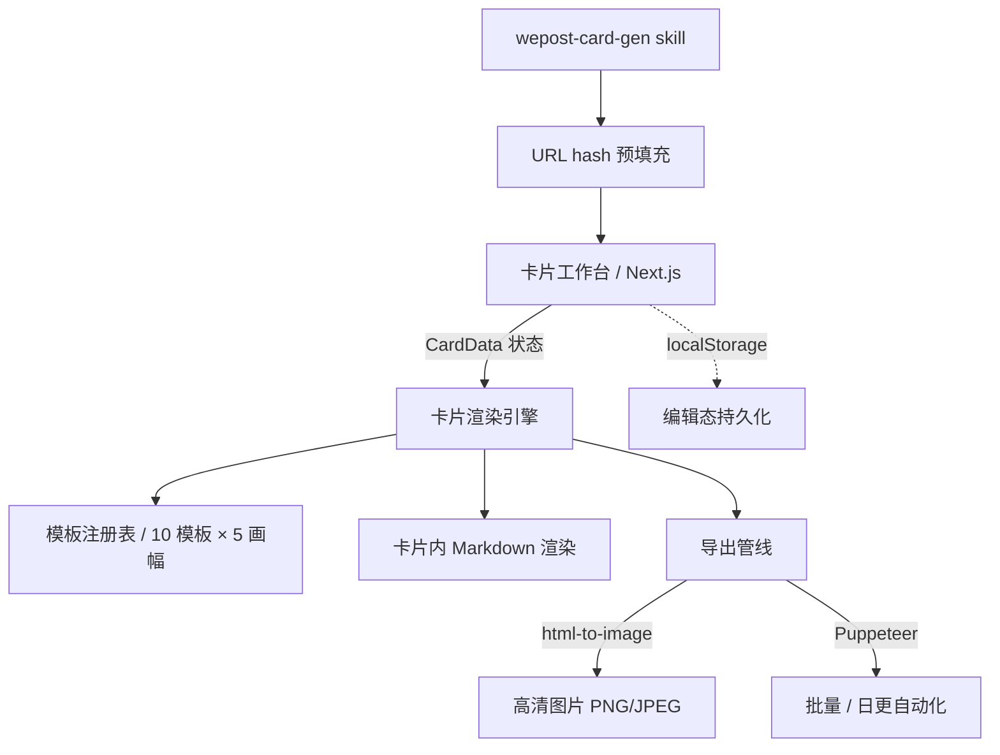

# WePost 智能体与开发者协作指南 (AGENTS.md)

欢迎协同开发 **WePost** 项目。本文档面向参与本项目代码阅读、架构设计、核心研发、故障诊断以及代码评审的 AI Agent 及人类开发者，旨在建立统一的技术规范、智能体角色分工、架构约束与质量标准。

---

## 1. 项目概览与定位

**WePost** 是一站式**社交媒体卡片生成器**：把任意文字内容（金句、早报、随笔、开发笔记、态度观点等）结构化为 `CardData`，自动匹配模板与画幅，渲染为精美卡片并可导出高清图片，用于小红书、朋友圈、公众号封面等社交场景。

### 核心能力矩阵
- **卡片渲染引擎**：Markdown / 富文本渲染、10 套卡片模板、5 种画幅比例、统一尺寸数据源。
- **内容编辑工作台**：内容表单、样式工具栏、导出面板、撤销 / 重做历史、正文溢出预警、内容预设。
- **导出与自动化**：浏览器内 `html-to-image` 导出、Puppeteer 批量 / 日更出图脚本、URL hash 预填充注入。
- **静态部署**：`next build` 静态导出至 `out/`，部署于 Cloudflare Pages。

> 多平台分发（公众号 / 知乎 / 头条 / 小红书）、AI 辅助创作、媒体对象存储为**远期可选**能力（见 [ROADMAP](docs/ROADMAP.md) Phase 3 / Phase 5），当前静态卡片生成器架构不依赖。

---

## 2. 核心铁律与强制约束 (Hard Constraints)

所有在本项目中工作的 AI Agent 与人类开发者必须**无条件遵守**以下规则：

> [!IMPORTANT]
> 1. **语言规范**：所有的规划、思考、沟通、文档与回复必须**统一使用中文**。
> 2. **前端图标规范**：编写前端 UI 时，**严禁使用 Emoji**，必须使用专业矢量图标库（如 `Lucide React`、`Radix Icons` 或标准 SVG 矢量组件）。
> 3. **构建与部署闭环**：修改完成后必须保证 `npm run build` 静态导出通过、`npm run test` 全绿；涉及 `src/core` 或部署配置的变更，须确认 `out/` 产物可正常部署至 Cloudflare Pages。

---

## 3. 智能体角色体系 (.claude/agents/)

为保障高质量交付，本项目预置 4 种专职 Agent 角色配置文件：

| 角色 | 配置文件 | 职责范畴 |
| :--- | :--- | :--- |
| **Architect** | [.claude/agents/architect.md](file:///.claude/agents/architect.md) | **系统架构与技术选型**：负责卡片渲染引擎、模板注册表、导出管线与扩展点设计；远期分发架构预留把控。 |
| **Developer** | [.claude/agents/developer.md](file:///.claude/agents/developer.md) | **核心业务功能实现**：高标准完成卡片模板、渲染器、编辑器、导出、历史与预填充等功能编码与单元测试。 |
| **Reviewer** | [.claude/agents/reviewer.md](file:///.claude/agents/reviewer.md) | **代码审查与规范合规**：审查 Diff 安全性、性能瓶颈、类型完备性，重点检查 Emoji 违规与构建 / 测试闭环检查点。 |
| **Debugger** | [.claude/agents/debugger.md](file:///.claude/agents/debugger.md) | **故障诊断与性能调优**：排查导出渲染偏差、模板尺寸失真、溢出误报、Puppeteer 出图失败等异常。 |

---

## 4. 技术栈与架构选型 (Technology Stack)



### 当前技术栈
- **前端核心**：Next.js (App Router) / React / TypeScript
- **前端样式与组件**：Tailwind CSS / CSS Modules + Radix UI / shadcn/ui，矢量图标使用 `Lucide React`（禁止 Emoji）
- **卡片渲染**：自研渲染引擎（画板舞台 + 模板组件 + 统一尺寸数据源）
- **图片导出**：`html-to-image`（浏览器内）+ Puppeteer（无头自动化）
- **部署**：Cloudflare Pages（`wrangler` 静态托管 / 边缘分发）

### 远期可选技术栈（Phase 5 启动前不落地）
- **数据层与 ORM**：PostgreSQL / SQLite + Prisma ORM
- **缓存与队列**：Redis / BullMQ（用于长耗时发布任务与 AI 生成队列）
- **对象存储**：火山引擎 TOS / AWS S3 / 本地存储适配器

---

## 5. 项目目录结构规划

```
WePost/
├── .claude/
│   ├── agents/                # Claude / Agent 角色配置
│   │   ├── architect.md
│   │   ├── developer.md
│   │   ├── reviewer.md
│   │   └── debugger.md
│   └── skills/wepost-card-gen # 把文字一键做成卡片的 Claude skill
├── docs/                      # 项目深度设计文档
│   ├── ARCHITECTURE.md        # 架构设计与领域模型
│   ├── CONTRIBUTING.md        # 贡献与协作规范
│   └── ROADMAP.md             # 里程碑与迭代计划
├── scripts/                  # 自动化脚本
│   ├── export-card*.mjs       # Puppeteer 批量出图
│   ├── export-daily.mjs       # 日更流水线
│   └── gen-card-url.mjs       # CardData → 预填充 URL 编码工具
├── src/                       # 源码核心目录
│   ├── app/                   # 前端页面路由
│   ├── components/
│   │   ├── canvas/            # 画板舞台、渲染器、缩略图
│   │   ├── templates/          # 卡片模板实现
│   │   ├── editor/             # 内容表单、样式工具栏、导出面板
│   │   └── ui/                 # 基础 UI 组件
│   ├── core/
│   │   ├── templates/          # 模板与画幅注册表（唯一尺寸数据源）
│   │   └── export/             # 图片导出管线
│   ├── data/presets.ts         # 内容预设
│   ├── lib/                    # hooks 与工具（导出、历史、溢出、注入、文件名）
│   └── types/card.ts           # 核心类型定义
├── tests/                     # 自动化测试用例（vitest）
├── .env.example               # 环境变量模版
├── .gitignore                 # Git 忽略文件配置
├── AGENTS.md                  # Agent 行为指南 (本文件)
├── LICENSE                    # 开源许可证 (MIT)
├── README.md / README.en.md   # 中英主项目说明
└── wrangler.toml              # Cloudflare Pages 部署配置
```

---

## 6. 编码规范与设计原则

### 1. 严格类型与模块化
- 严禁滥用 `any`，所有业务实体必须在 `src/types/card.ts` 或对应模块中定义明确的 TypeScript `interface` / `type`。
- 遵循单一职责原则（SRP），模板组件、渲染器与导出管线必须高内聚、低耦合。
- `src/core/templates/registry.ts` 是模板与画幅元数据的**唯一数据源**，新增模板或画幅只在此处登记，避免散落硬编码。

### 2. 前端设计与无 Emoji 原则
- 页面必须保持现代、精致且专业的视觉体验，严禁在 UI 界面或按钮中使用 Emoji 字符作为图标。
- 统一引入矢量图标：
  ```tsx
  // 正确示例:
  import { FileText, Send, Settings, CheckCircle2 } from "lucide-react";
  <button className="flex items-center gap-2"><Send className="w-4 h-4" /> 导出</button>

  // 错误示例 (严格禁止):
  <button>🚀 导出</button>
  ```

### 3. 构建与部署闭环
- 任何代码修改完成后，必须执行 `npm run test` 与 `npm run build`，确认测试全绿且静态导出产物正常。
- 涉及 `src/core`、`next.config.mjs` 或 `wrangler.toml` 的变更，须确认 `out/` 产物结构与 Cloudflare Pages 部署不受影响。

### 4. 平台发布适配器设计（远期 · Phase 5）
> 当前产品为纯前端卡片生成器，**不含发布能力**。以下契约为多平台分发阶段（见 [ROADMAP](docs/ROADMAP.md) Phase 5）的预留设计，尚未落地，当前不实现。

若启动远期分发阶段，每个发布渠道（如微信公众平台 `WechatPublisher`）须实现统一的 `IPublisher` 契约：
  - `validateConfig(): Promise<boolean>`
  - `uploadMedia(file: MediaFile): Promise<UploadResult>`
  - `publish(article: ArticlePayload): Promise<PublishResult>`
  - `getPublishStatus(taskId: string): Promise<TaskStatus>`

---

### 5. 卡片数据预填充注入契约（#card= hash）

为支持外部（如 `.claude/skills/wepost-card-gen` skill、分享链接）一键把结构化内容注入画板，应用接受 URL hash 形式的卡片数据预填充：

- **协议**：`http://localhost:3000/#card=<base64url-json>`，其中 JSON 为合法的 `Partial<CardData>`。
- **实现**：`src/lib/cardImport.ts` 的 `decodeCardDataFromHash`（纯函数，可单测）+ `loadCardDataFromHash`（读取并消费 hash）。
- **优先级**：URL hash 注入 > localStorage 上次编辑 > `INITIAL_CARD_DATA` 默认示例。
- **向后兼容**：无 `#card=` 时行为与此前完全一致；hash 消费后清除，刷新读取 localStorage 中的最新编辑。
- **编码工具**：`scripts/gen-card-url.mjs`（读 CardData JSON 文件 → 输出预填充 URL）。
- **约束**：注入的 `templateId` / `aspectRatio` 必须为合法枚举值；其余字段缺失时与默认值合并兜底。修改注入逻辑须同步更新 `tests/cardImport.test.ts`。

---

## 7. Git 提交规范 (Conventional Commits)

提交信息一律采用小写类型前缀，格式如下：
```
<type>(<scope>): <subject>
```

| 类型 | 说明 |
| :--- | :--- |
| `feat` | 新增功能 (feature) |
| `fix` | 修复缺陷 (bug fix) |
| `docs` | 仅文档更新 |
| `style` | 不影响代码含义的格式调整 (空格, 格式化, 缺少分号等) |
| `refactor` | 重构代码 (既不新增功能也不修复 bug) |
| `perf` | 性能优化 |
| `test` | 新增或修正测试 |
| `chore` | 构建流程、依赖或辅助工具变动 |

---

## 8. 变更说明

本指南于 **2026-08-25** 对齐卡片生成器定位。早期版本设想的「微信多平台发布引擎」相关内容（Admin 部署闭环、`IPublisher` 即时实现、Prisma + PostgreSQL / Redis + BullMQ 作为当前技术栈、`src/core/parser` / `theme` / `publisher` 目录）在当前静态前端架构中不适用：空壳目录已删除，`IPublisher` 降级为远期 Phase 5 预留契约，原 Admin 闭环改为「构建与部署闭环」。多平台分发保留为远期可选阶段。
