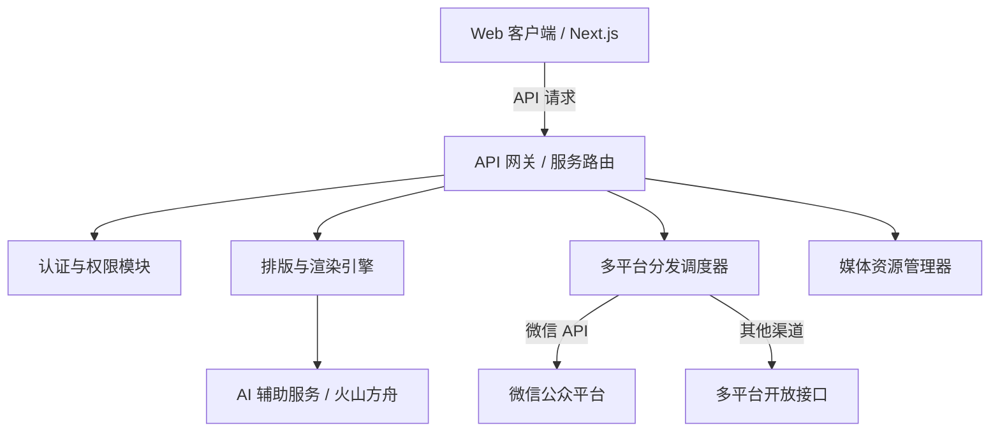

# WePost 智能体与开发者协作指南 (AGENTS.md)

欢迎协同开发 **WePost** 项目。本文档面向参与本项目代码阅读、架构设计、核心研发、故障诊断以及代码评审的 AI Agent 及人类开发者，旨在建立统一的技术规范、智能体角色分工、架构约束与质量标准。

---

## 1. 项目概览与定位

**WePost** 是一站式现代内容创作、多主题智能排版与多平台发布平台（支持微信公众号、知乎、头条、小红书等社交媒体生态）。

### 核心能力矩阵
- **智能排版引擎**：Markdown / 富文本双向转换、多主题样式渲染、代码块高亮与公式排版。
- **多平台分发通道**：微信公众平台草稿箱/群发、社交平台 API 适配与一键发布调度。
- **AI 辅助创作**：文章大纲生成、文案润色、AI 配图与摘要提炼。
- **媒体资源库**：图片管理、格式转换、智能压缩与对象存储（TOS / S3 / 本地）。

---

## 2. 核心铁律与强制约束 (Hard Constraints)

所有在本项目中工作的 AI Agent 与人类开发者必须**无条件遵守**以下规则：

> [!IMPORTANT]
> 1. **语言规范**：所有的规划、思考、沟通、文档与回复必须**统一使用中文**。
> 2. **前端图标规范**：编写前端 UI 时，**严禁使用 Emoji**，必须使用专业矢量图标库（如 `Lucide React`、`Radix Icons` 或标准 SVG 矢量组件）。
> 3. **Admin 部署约束**：若修改了与 **admin（后台管理系统）** 相关的任何代码，在修改完成并验证通过后，**必须将其推送/部署到生产环境**并提示运维状态。

---

## 3. 智能体角色体系 (.claude/agents/)

为保障高质量交付，本项目预置 4 种专职 Agent 角色配置文件：

| 角色 | 配置文件 | 职责范畴 |
| :--- | :--- | :--- |
| **Architect** | [.claude/agents/architect.md](file:///.claude/agents/architect.md) | **系统架构与技术选型**：负责领域模型设计、API 协议演进、多平台发布调度器架构设计、存储与扩展性把控。 |
| **Developer** | [.claude/agents/developer.md](file:///.claude/agents/developer.md) | **核心业务功能实现**：高标准完成排版引擎、发布管道、用户鉴权、媒体处理等功能编码与单元测试。 |
| **Reviewer** | [.claude/agents/reviewer.md](file:///.claude/agents/reviewer.md) | **代码审查与规范合规**：审查 Diff 安全性、性能瓶颈、类型完备性，重点检查 Emoji 违规与 Admin 部署检查点。 |
| **Debugger** | [.claude/agents/debugger.md](file:///.claude/agents/debugger.md) | **故障诊断与性能调优**：排查 API 请求失败、发布超时、排版样式污染、内存泄漏等异常。 |

---

## 4. 技术栈与架构选型 (Technology Stack)



### 推荐技术栈
- **前端核心**：Next.js (App Router) / React / TypeScript
- **前端样式与组件**：Tailwind CSS / CSS Modules + Radix UI / shadcn/ui，矢量图标使用 `Lucide React`（禁止 Emoji）
- **后端服务**：Node.js (TypeScript) / Next.js API Routes 或独立 Express/Fastify 服务
- **数据层与 ORM**：PostgreSQL / SQLite + Prisma ORM
- **缓存与队列**：Redis / BullMQ（用于长耗时发布任务与 AI 生成队列）
- **对象存储**：火山引擎 TOS / AWS S3 / 本地存储适配器

---

## 5. 项目目录结构规划

```
WePost/
├── .claude/                # Claude / Agent 角色与提示词配置
│   └── agents/
│       ├── architect.md    # 架构师角色
│       ├── developer.md    # 开发者角色
│       ├── reviewer.md     # 代码审查员角色
│       └── debugger.md     # 调试诊断角色
├── docs/                   # 项目深度设计文档
│   ├── ARCHITECTURE.md     # 架构设计与领域模型
│   ├── CONTRIBUTING.md     # 贡献与协作规范
│   └── ROADMAP.md          # 里程碑与迭代计划
├── src/                    # 源码核心目录
│   ├── app/                # 前端页面路由 / API 端点
│   ├── components/         # 可复用 UI 组件 (图标统一使用 Lucide)
│   ├── core/               # 核心业务逻辑与排版渲染引擎
│   │   ├── parser/         # Markdown / HTML 解析器
│   │   ├── theme/          # 排版主题与样式生成器
│   │   └── publisher/      # 平台发布适配器 (微信、知乎等)
│   ├── lib/                # 通用工具库与第三方客户端
│   ├── types/              # 全局 TypeScript 类型定义
│   └── server/             # 后端服务、数据库模型与存储适配
├── tests/                  # 自动化测试用例
├── .editorconfig           # 代码格式化规范
├── .env.example            # 环境变量模版
├── .gitignore              # Git 忽略文件配置
├── AGENTS.md               # Agent 行为指南 (本文件)
├── LICENSE                 # 开源许可证 (MIT)
├── README.md               # 中文主项目说明
└── README.en.md            # 英文项目说明
```

---

## 6. 编码规范与设计原则

### 1. 严格类型与模块化
- 严禁滥用 `any`，所有业务实体必须在 `src/types/` 或对应模块中定义明确的 TypeScript `interface` / `type`。
- 遵循单一职责原则（SRP），发布适配器、排版解析器与存储驱动必须高内聚、低耦合。

### 2. 前端设计与无 Emoji 原则
- 页面必须保持现代、精致且专业的视觉体验，严禁在 UI 界面或按钮中使用 Emoji 字符作为图标。
- 统一引入矢量图标：
  ```tsx
  // 正确示例:
  import { FileText, Send, Settings, CheckCircle2 } from "lucide-react";
  <button className="flex items-center gap-2"><Send className="w-4 h-4" /> 发布</button>

  // 错误示例 (严格禁止):
  <button>🚀 发布</button>
  ```

### 3. Admin 修改与部署闭环
- 修改 `admin` 涉及的后台页面、权限策略或 API 时，必须执行测试闭环。
- 确认修改后，触发部署流程并输出部署报告。

### 4. 平台发布适配器设计
- 每一个发布渠道（如微信公众平台 `WechatPublisher`）必须实现统一的 `IPublisher` 接口契约：
  - `validateConfig(): Promise<boolean>`
  - `uploadMedia(file: MediaFile): Promise<UploadResult>`
  - `publish(article: ArticlePayload): Promise<PublishResult>`
  - `getPublishStatus(taskId: string): Promise<TaskStatus>`

---

### 5. 卡片数据预填充注入契约（#card= hash）

为支持外部（如 `.claude/skills/wepost-card-gen` skill、分享链接）一键把结构化内容注入画板，应用接受 URL hash 形式的卡片数据预填充：

- **协议**：`http://localhost:3000/#card=<base64url-json>`，其中 JSON 为合法的 `Partial<CardData>`。
- **实现**：`src/lib/cardImport.ts` 的 `decodeCardDataFromHash`（纯函数，可单测）+ `loadCardDataFromHash`（读取并消费 hash）。
- **优先级**：URL hash 注入 > localStorage 上次编辑 > `INITIAL_CARD_DATA` 默认示例。
- **向后兼容**：无 `#card=` 时行为与此前完全一致；hash 消费后清除，刷新读取 localStorage 中的最新编辑。
- **编码工具**：`scripts/gen-card-url.mjs`（读 CardData JSON 文件 → 输出预填充 URL）。
- **约束**：注入的 `templateId` / `aspectRatio` 必须为合法枚举值；其余字段缺失时与默认值合并兜底。修改注入逻辑须同步更新 `tests/cardImport.test.ts`。

---

## 7. Git 提交规范 (Conventional Commits)

提交信息一律采用小写类型前缀，格式如下：
```
<type>(<scope>): <subject>
```

| 类型 | 说明 |
| :--- | :--- |
| `feat` | 新增功能 (feature) |
| `fix` | 修复缺陷 (bug fix) |
| `docs` | 仅文档更新 |
| `style` | 不影响代码含义的格式调整 (空格, 格式化, 缺少分号等) |
| `refactor` | 重构代码 (既不新增功能也不修复 bug) |
| `perf` | 性能优化 |
| `test` | 新增或修正测试 |
| `chore` | 构建流程、依赖或辅助工具变动 |
