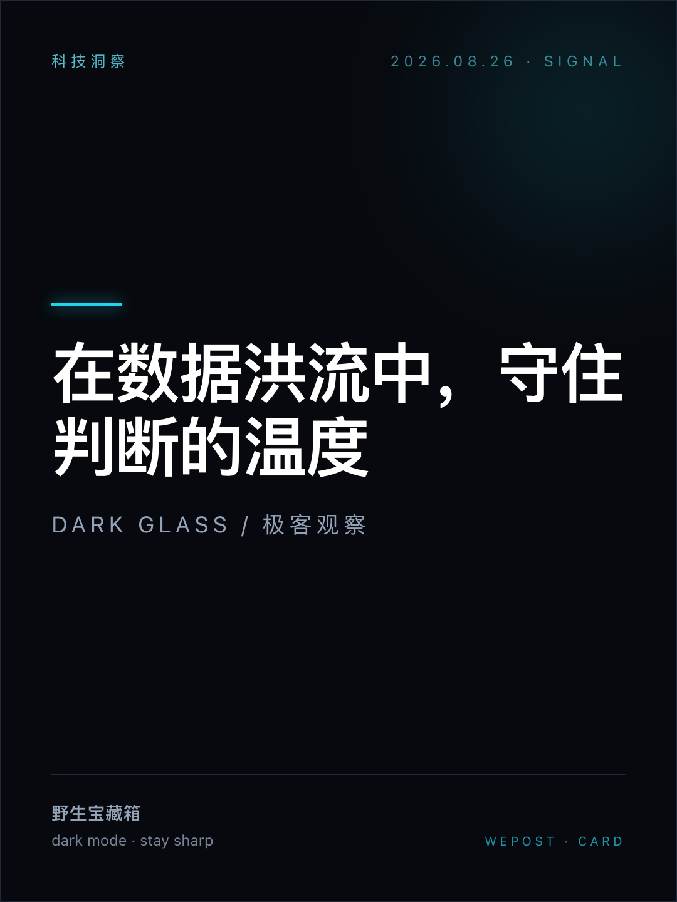
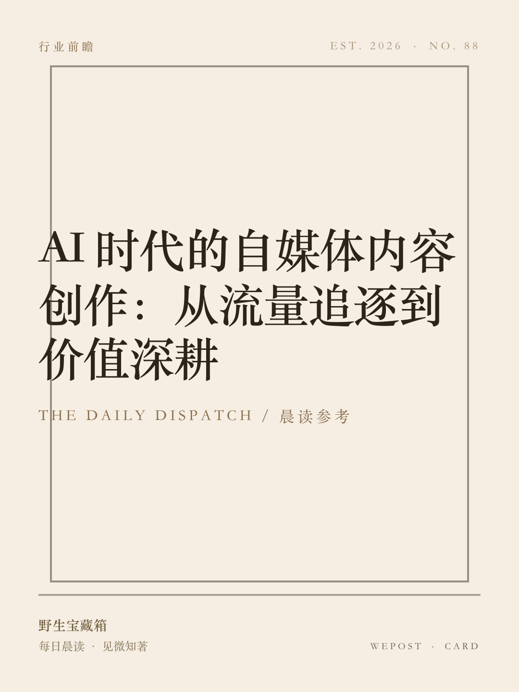
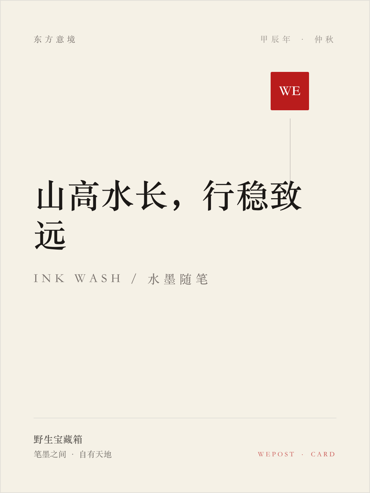

# WePost

<div align="center">

**All-in-One Social Media Card Generator: turn text into beautiful, exportable card images**

[](https://github.com/zaneven/WePost/actions/workflows/deploy.yml)
[](https://www.typescriptlang.org/)
[](https://nextjs.org/)
[](LICENSE)
[](docs/CONTRIBUTING.md)

**Live Demo: <https://zaneven.github.io/WePost/>**  
**Production Base: <https://wepost.zaneven.com>**

[中文文档](README.md) | [English](README.en.md) | [Architecture](docs/ARCHITECTURE.md) | [Contributing](docs/CONTRIBUTING.md) | [Roadmap](docs/ROADMAP.md)

</div>

---

## Introduction

**WePost** is a card generation workbench designed for content creators, media operators, and developers. It structures any text—quotes, daily briefings, essays, dev notes, and opinions—into `CardData`, auto-matches templates and aspect ratios, renders cards in real time, and exports high-resolution images ready for Xiaohongshu, WeChat Moments, and Official Account covers.

The project supports pure-frontend static deployment (GitHub Pages) and is paired with a production service running headless rendering APIs (`/api/render`) and management console at `https://wepost.zaneven.com`.

---

## Use Cases

WePost quickly turns any text into ready-to-publish social images across high-frequency scenarios:

- **Xiaohongshu (XHS) posts & covers**: note covers, collection covers, quote stickers—3:4 portrait and 1:1 square, paired with "Cover Card Mode" for high-CTR cover images
- **WeChat Moments / 9-grid**: daily check-ins, casual notes, greetings in a clean 1:1 square layout
- **WeChat Official Account covers**: 2.35:1 banner headers, paired with Vintage Press / Editorial Bold for news and opinion
- **WeChat Video Account covers**: 9:16 full-screen portrait, Neon Cyber / Dark Glass for tech and trends
- **Quote / saying images**: Zen Aesthetic / Ink Wash templates for zen quotes and poetry
- **Daily briefing / news images**: Vintage Press with tables / quotes / lists for high information density
- **Dev notes / code screenshots**: Terminal Code template + Shiki syntax highlighting—turn code snippets into shareable images
- **Long-text / multi-card series & stitched long images**: smart multi-card deck splitting, cover card mode, batch-numbered export, and one-click long image stitching
- **Article / blog illustrations**: Markdown paragraphs, inline images (``), blockquotes, formulas (KaTeX) rendered with ease

---

## Template Gallery

10 hand-crafted card templates spanning dark/light, Eastern/modern, vintage/trendy styles. The samples below are real exports rendered via WePost's `/export` route (3:4 aspect, with Shiki syntax highlighting, tables, KaTeX formulas, watermarks, etc.):

### Standard Content Templates

| | |
|:---:|:---:|
| **Minimalist Magazine**<br><sub>极简杂志</sub><br> | **Modern Dark Glass**<br><sub>暗黑毛玻璃</sub><br> |
| **Vintage Press**<br><sub>复古报刊</sub><br> | **Warm Healing Note**<br><sub>温暖便签</sub><br> |
| **Zen Aesthetic**<br><sub>东方留白</sub><br> | **Acid & Neo-Brutalism**<br><sub>酸性潮流</sub><br> |
| **Ink Wash Aesthetic**<br><sub>水墨留白</sub><br> | **Terminal / Dev Note**<br><sub>终端代码</sub><br> |
| **Editorial Bold**<br><sub>先锋杂志</sub><br> | **Neon Cyberpunk**<br><sub>霓虹赛博</sub><br> |

### Cover Card Mode (Single-Page Title Mode)

When "Cover Card Mode" is enabled, the first card is rendered as a standalone **headline cover card** (content starts from the second card onwards), tailor-made for multi-card carousel covers, Xiaohongshu first slides, and article header banners:

| | |
|:---:|:---:|
| **Minimalist Magazine · Cover**<br> | **Modern Dark Glass · Cover**<br> |
| **Vintage Press · Cover**<br> | **Acid & Neo-Brutalism · Cover**<br> |
| **Warm Healing Note · Cover**<br> | **Ink Wash Aesthetic · Cover**<br> |

> Try all templates & cover modes live: <https://zaneven.github.io/WePost/>

---

## Key Features

### 1. Card Rendering Engine
- **Versatile Markdown / Rich Text**: Headings, paragraphs, nested blockquotes (`>>`), ordered/unordered lists, task lists (`- [ ]` / `- [x]`), tables, and fenced code blocks
- **Image & Text Mixing**: Native Markdown image rendering (``) and built-in local image upload support in the editor
- **10 Curated Card Templates**: Minimal Magazine, Dark Glass, Vintage Press, Warm Memo, Zen Aesthetic, Acid Bold, Ink Wash, Terminal Code, Editorial Bold, and Neon Cyber
- **Multi-Aspect Ratios**: UI prioritizes 3:4 (XHS/WeChat), 1:1 (square), and 9:16 (vertical story); registry preserves 2.35:1 and 4:3 compatibility
- **Code Syntax Highlighting**: Powered by [Shiki](https://shiki.style/) with on-demand language and WASM loading for export fidelity
- **Math Formula Rendering**: Powered by [KaTeX](https://katex.org/) supporting inline `$...$` and block `$$...$$` with embedded fonts
- **Open-Source CJK Font Library**: Integrated Noto Sans SC, Noto Serif SC, LXGW WenKai, and system font stacks with live dropdown preview
- **Single Source of Truth**: `getCanvasDimensions` provides unified dimensions across canvas stages and export pipelines

### 2. Modern Content Workbench
- **AI Auto-Fill**: Paste raw articles, notes, news, or memos—LLMs extract structured fields (titles, body, author, date, tag, and style params) and auto-fill the form with undo support
- **Three-Column Desktop Layout**: Left content editor, middle responsive stage, and right Figma-style collapsible settings panel
- **Mobile Editor Sheet**: Dedicated bottom drawer editor (`MobileEditorSheet`) for intuitive mobile phone operation
- **Dark & Light Themes**: Default dark immersion theme with a smooth one-click toggle in the header; fully adapted modals, toasts, and candidate cards
- **Long-Text Splitting & Multi-Card Decks**:
  - **Auto Splitting**: Capacity estimation by aspect ratio and font size, block-atomic
  - **Divider Splitting**: Split manually with `---` in Markdown
  - **Cover Card Mode**: Turn the first card into a large headline cover card
- **Smart Style Matching**: `recommendStyle` heuristic engine suggests templates, aspect ratios, and fonts based on content characteristics (pure function, zero external dependencies)
- **9 Inspiration Presets**: One-click application for quotes, tech, news, and healing notes
- **History & Overflow Warning**: Undo/redo history with keyboard shortcuts and localStorage persistence; real-time overflow warning

### 3. High-Res Export & API Capabilities
- **Multi-Format Export**: In-browser export via `html-to-image` at 2x / 3x scale, PNG / JPEG downloads, and instant copy to clipboard
- **Long-Image Stitching**: Seamlessly stitch all cards in a deck into one continuous long image and copy to clipboard
- **Copy API Parameters**: One-click copy of the active card state as a `POST /api/render` JSON payload for Agents and script automation
- **Headless Automation**: Puppeteer scripts and `/export` route for daily briefing pipelines and CI automated exports
- **URL Hash Protocol**: `#card=<base64url-json>` pure client-side injection protocol for instant sharing and skill integration

---

## Tech Stack

| Layer | Stack | Description |
| :--- | :--- | :--- |
| **Frontend Framework** | Next.js 14 (App Router), React 18, TypeScript 5 | Pure static export with client-side state & persistence |
| **Styling & UI** | Tailwind CSS, Lucide React | Unified vector icons, strict no-emoji policy |
| **Open-Source Fonts** | Noto Sans SC, Noto Serif SC, LXGW WenKai | Self-hosted commercially-free Chinese font library |
| **Rendering Engine** | Custom CardRenderer + CardStage + Registry | Single source of dimensions, adaptive canvas scale |
| **Rich Text Parsing** | Custom Markdown parser + Shiki + KaTeX | Headings / quotes / lists / tables / math / images |
| **Image Export** | html-to-image, file-saver | Browser high-res image export & long-image stitching |
| **Headless Automation** | puppeteer-core | Headless rendering and automated sample generation |
| **Production API** | Cloudflare Workers (WePost-API) | Single-source `/api/render` endpoint & full service |
| **Static Hosting** | GitHub Pages (Actions) | Automated CI static preview deployment |

---

## Quick Start

### 1. Requirements

- Node.js >= 18.18.0 (20.x+ recommended)
- npm >= 9.x
- Git

### 2. Clone & Install

```bash
git clone https://github.com/zaneven/WePost.git
cd WePost
npm install
```

### 3. Development Server

```bash
npm run dev
```

Open [http://localhost:3000](http://localhost:3000) in your browser.

### 4. Production Build & Tests

```bash
# Static export to out/ directory
npm run build

# Run unit tests
npm test
```

---

## Deployment

WePost compiles into a static production bundle in `out/` via `next build`.

### Static Site (GitHub Pages)

Pushing to `main` automatically triggers [`.github/workflows/deploy.yml`](.github/workflows/deploy.yml):
1. Injects `GITHUB_PAGES=true` to configure subpath base URLs
2. Generates `out/.nojekyll` and publishes to GitHub Pages
3. Live URL: <https://zaneven.github.io/WePost/>

### Production Service (wepost.zaneven.com)

The full production service (frontend app + headless rendering worker + Agent API) is consolidated into the `WePost-API` repository:
- Deployed to Cloudflare Workers with unified domain handling
- The legacy `npm run deploy` script in this repo has been deprecated in favor of the upstream assembly pipeline

---

## Project Structure

```
WePost/
├── .github/workflows/         # CI/CD: GitHub Pages automated deployment
├── .claude/
│   ├── agents/                # AI Agent role definitions & collaboration rules
│   └── skills/wepost-card-gen # Claude skill for direct API card generation
├── docs/                      # Documentation
│   ├── ARCHITECTURE.md        # Architecture & domain model
│   ├── CONTRIBUTING.md        # Contribution guidelines
│   ├── ROADMAP.md             # Project roadmap & milestones
│   └── samples/               # 20 real export samples (templates & cover cards)
├── scripts/                   # Automation scripts
│   ├── gen-template-samples.mjs # Automated sample generator (templates + covers)
│   ├── template-samples.json    # Sample dataset
│   ├── export-card*.mjs       # Headless card export scripts
│   └── export-daily.mjs       # Daily automated briefing export pipeline
├── src/
│   ├── app/                   # Next.js app router (/ and /export)
│   ├── components/
│   │   ├── canvas/            # Stage, CardRenderer, TitleCard, thumbnails
│   │   ├── templates/         # 10 card template components
│   │   ├── editor/            # 3-column workbench (ContentForm, SettingsPanel, etc.)
│   │   └── ui/                # Vector UI components (Toast, etc.)
│   ├── core/
│   │   ├── fonts.ts           # Open-source font registry & CSS stacks
│   │   ├── templates/         # Template registry & aspect ratios (single source)
│   │   ├── split/             # Multi-card deck splitting & capacity engine
│   │   ├── match/             # Heuristic style recommendation engine
│   │   └── export/            # Export pipeline & configurations
│   ├── data/presets.ts        # Content presets
│   ├── lib/                   # Hooks & utilities (aiFill, export, history, overflow)
│   └── types/card.ts          # Core CardData type definitions
├── tests/                     # Automated test suites (vitest)
├── AGENTS.md                  # Agent guidelines & hard constraints
├── README.md / README.en.md   # Bilingual primary documentation
└── wrangler.toml              # Deployment configuration
```

---

## AI Agents & wepost-card-gen Skill

### Collaboration Rules (AGENTS.md)
Every agent and developer follows [AGENTS.md](AGENTS.md):
1. **Chinese Language**: All plans, discussions, and docs are in Chinese.
2. **Vector Icons**: Strict ban on Emoji icons in frontend UI; use `Lucide React` vector icons.
3. **Quality Gates**: Every change must pass `npm test` and `npm run build`.

### wepost-card-gen Skill
The repository comes with the [`wepost-card-gen`](.claude/skills/wepost-card-gen/SKILL.md) skill:
- **Direct API Output**: Calls `POST https://wepost.zaneven.com/api/render` to render cards in the cloud and return image links—**no local dev server or browser required**.
- **Smart Structuring**: Give raw text, and the agent structures titles, quotes, author, date, tags, and matches the ideal template.
- **URL Hash Protocol**: Also supports `#card=<base64url-json>` for direct browser preview and sharing.

---

## Roadmap

- [x] **Phase 1: Card Generation Core** — Rendering engine, 10 templates, aspect ratios, editor, image export, undo/redo, URL hash injection
- [x] **Phase 2: Quality & Rendering Enhancements** — Shiki syntax highlighting, KaTeX math, tables / quotes / task lists, Markdown image support, open-source fonts, visual snapshot tests
- [ ] **Phase 3: Content Input & Automation (In Progress)**
  - [x] Content-to-card smart recommendation (`recommendStyle`)
  - [x] Long-text multi-card splitting (auto capacity & divider) and batch export
  - [x] Cover card mode (headline cover card generation & headless export)
  - [x] AI auto-fill (extract structured card data from pasted text)
  - [x] Multi-card stitched long-image export
  - [x] Copy API parameters button
  - [ ] Daily briefing export pipeline productization
- [ ] **Phase 4: Sharing & Distribution** — URL hash sharing enhancements & lightweight analytics
- [ ] **Phase 5 (Future Optional): Multi-Platform Matrix** — Adapters for Official Accounts, Zhihu, Toutiao, and Xiaohongshu

See [docs/ROADMAP.md](docs/ROADMAP.md).

---

## Contributing

Issues and PRs are welcome! Please check [docs/CONTRIBUTING.md](docs/CONTRIBUTING.md) and [AGENTS.md](AGENTS.md) first. Ensure `npm test` and `npm run build` pass before submitting.

---

## License

This project is licensed under the [MIT License](LICENSE) © 2026 WePost Contributors.

---

## Keywords

**Xiaohongshu**: XHS image generator · XHS cover maker · Xiaohongshu card tool · Social card maker · Note cover generator  
**WeChat**: Moments quotes · 9-grid image maker · Official Account header · Video account cover · Social card generator  
**Text to Image**: Text to image · Markdown to image · Quote image maker · Dev notes to image · One sentence to card  
**Formats**: Long image stitching · Multi-card deck · Cover card · Card generator · Web card workbench
