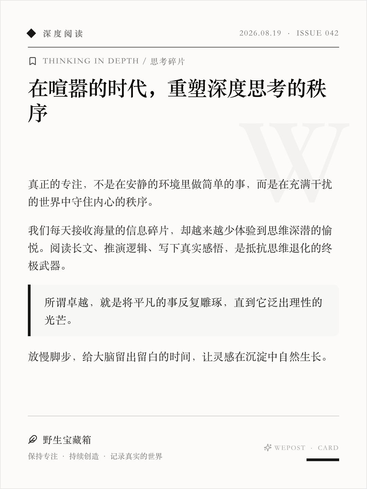
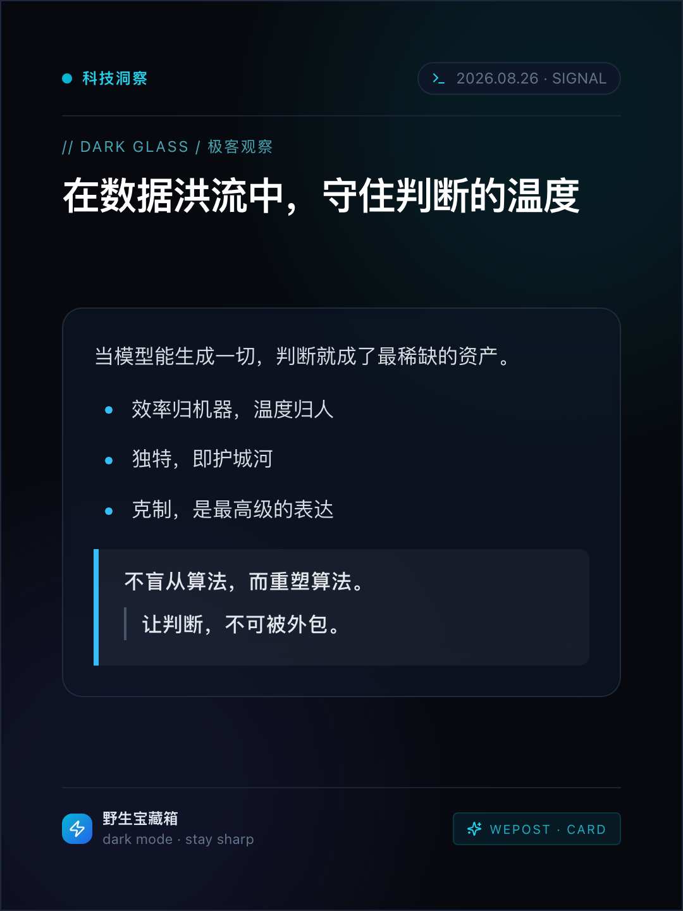
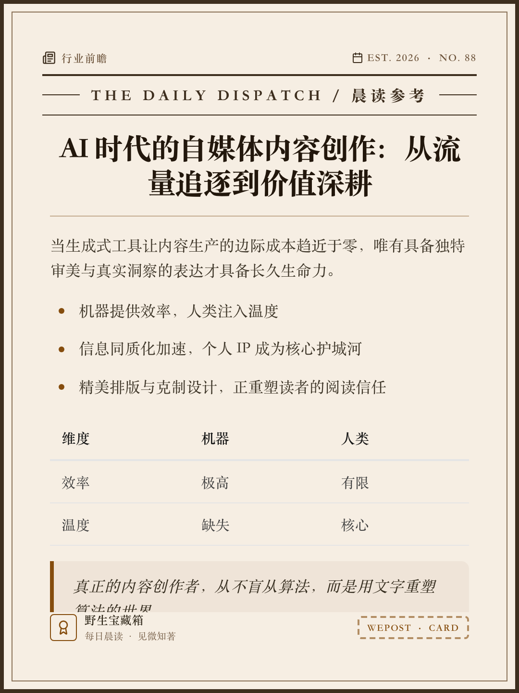
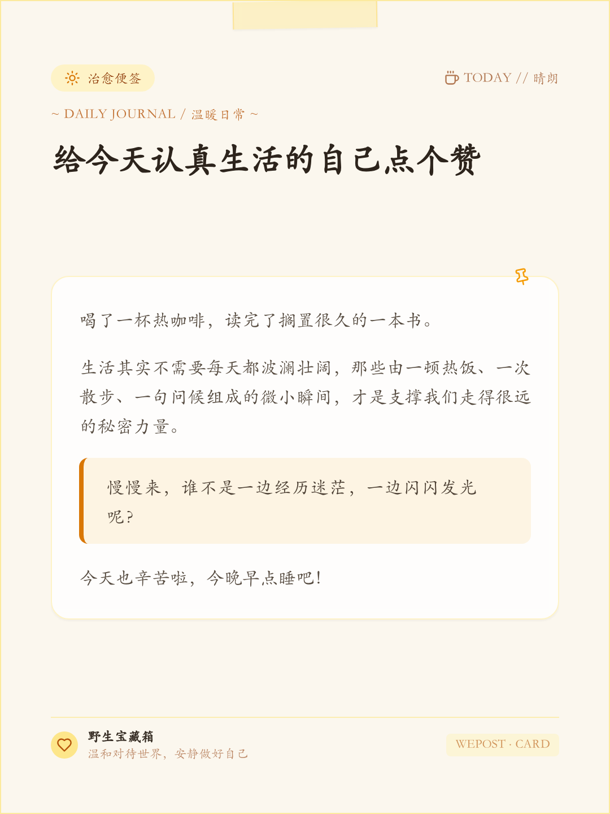
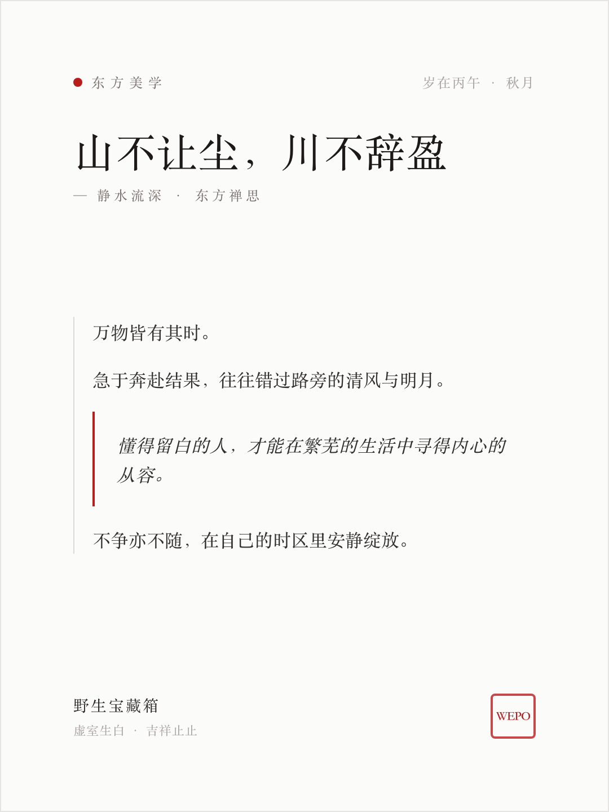
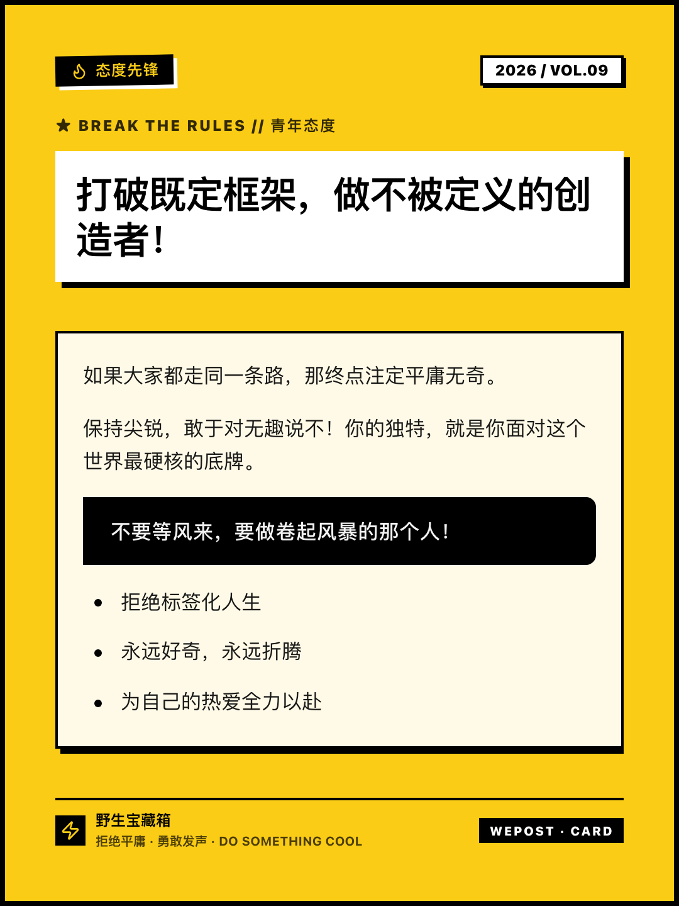
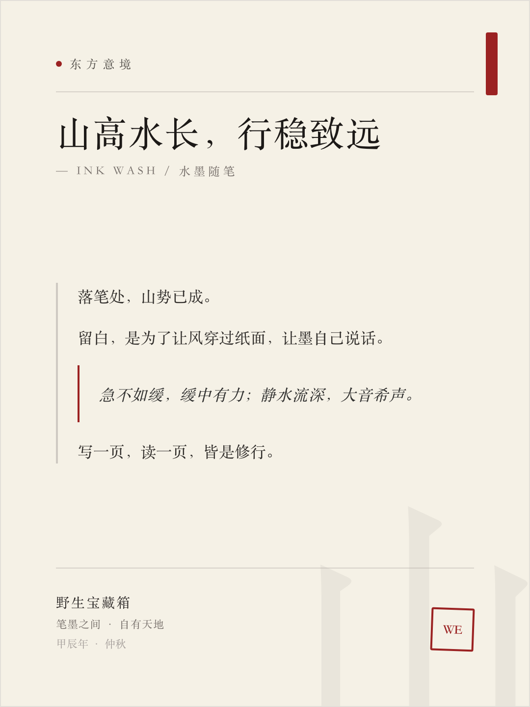
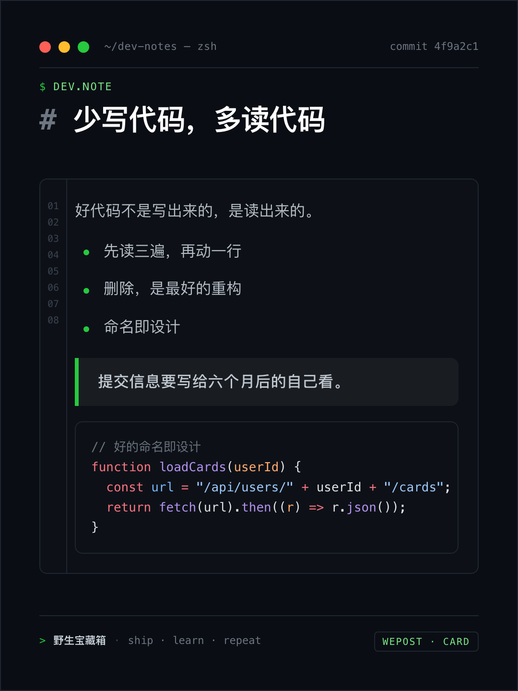
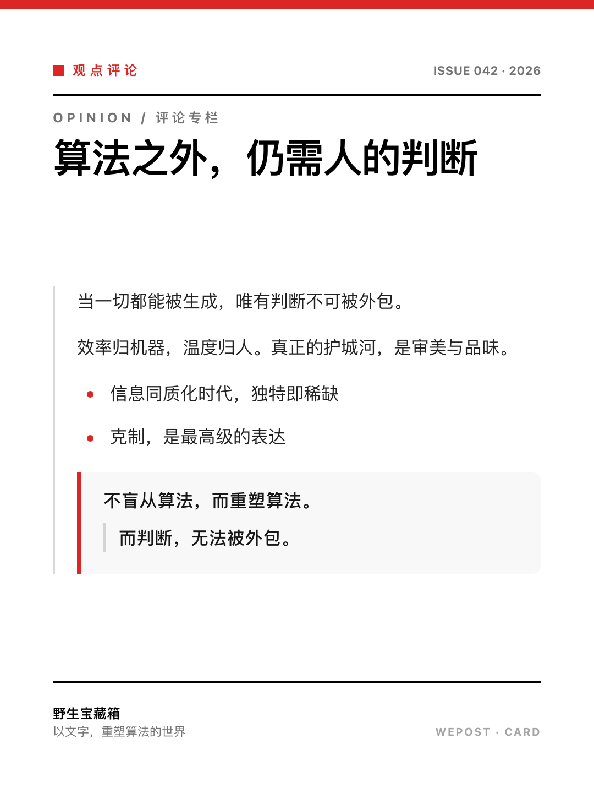
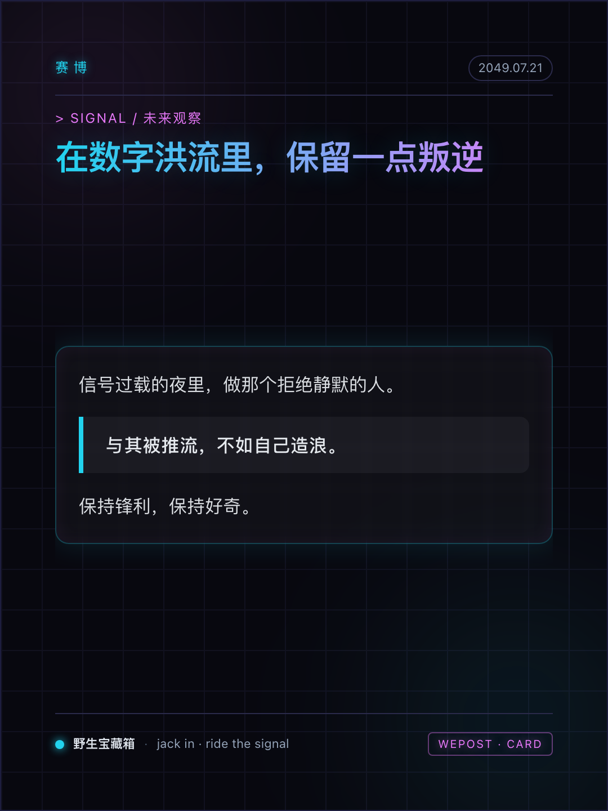

# WePost

<div align="center">

**All-in-One Social Media Card Generator: turn text into beautiful, exportable card images**

[](https://github.com/zaneven/WePost/actions/workflows/deploy.yml)
[](https://www.typescriptlang.org/)
[](https://nextjs.org/)
[](LICENSE)
[](docs/CONTRIBUTING.md)

**🚀 Live Demo: <https://zaneven.github.io/WePost/>**

[中文文档](README.md) | [English](README.en.md) | [Architecture](docs/ARCHITECTURE.md) | [Contributing](docs/CONTRIBUTING.md)

</div>

---

## 📖 Introduction

**WePost** is a card generation workbench for content creators, media operators, and developers. It structures any text—quotes, daily briefings, essays, dev notes, opinions—into `CardData`, auto-matches a template and aspect ratio, renders it as a beautiful card in real time, and exports high-resolution images ready for Xiaohongshu, WeChat Moments, and Official Account covers.

A pure-frontend architecture with no backend dependency, deployable as a static site to Cloudflare Pages or GitHub Pages.

---

## 🎯 Use Cases

WePost turns any text into ready-to-publish social images across high-frequency creation scenarios:

- **Xiaohongshu (XHS) posts & covers**: note covers, collection covers, quote stickers—3:4 portrait and 1:1 square with Minimal Magazine, Acid Bold, and more
- **WeChat Moments / 9-grid**: daily check-ins, casual notes, greetings—comfortable 1:1 layout
- **WeChat Official Account covers**: 2.35:1 banner headers, paired with Vintage Press / Editorial Bold for news and opinion
- **WeChat Video Account (Channels) covers**: 9:16 full-screen portrait, Neon Cyber / Dark Glass for tech and trends
- **Quote / saying images**: Zen Aesthetic / Ink Wash templates for zen quotes and poetry
- **Daily briefing / news images**: Vintage Press with tables / quotes / lists for high information density
- **Dev notes / code screenshots**: Terminal Code template + Shiki syntax highlighting—turn snippets into shareable images
- **Long-text / multi-image series**: smart splitting into card decks with batch-numbered export, ideal for Official Account long posts and XHS collections
- **Article / blog illustrations**: render Markdown paragraphs, quotes, and formulas (KaTeX) into polished images

> Whether posting to Xiaohongshu, Moments, making an Official Account cover, or turning text / code / quotes into shareable images, WePost generates them in a sentence.

---

## 🎨 Template Gallery

10 hand-crafted card templates spanning dark/light, Eastern/modern, vintage/trendy styles. The samples below are real exports rendered via WePost's `/export` route (3:4 aspect, with Shiki syntax highlighting, tables, watermark, etc.):

|  |  |
|:---:|:---:|
| **Minimalist Magazine**<br><sub>极简杂志</sub><br> | **Modern Dark Glass**<br><sub>暗黑毛玻璃</sub><br> |
| **Vintage Press**<br><sub>复古报刊</sub><br> | **Warm Healing Note**<br><sub>温暖便签</sub><br> |
| **Zen Aesthetic**<br><sub>东方留白</sub><br> | **Acid & Neo-Brutalism**<br><sub>酸性潮流</sub><br> |
| **Ink Wash Aesthetic**<br><sub>水墨留白</sub><br> | **Terminal / Dev Note**<br><sub>终端代码</sub><br> |
| **Editorial Bold**<br><sub>先锋杂志</sub><br> | **Neon Cyberpunk**<br><sub>霓虹赛博</sub><br> |

> 👉 Try all templates live: <https://zaneven.github.io/WePost/>

---

## 🌟 Key Features

- 🎨 **Card Rendering Engine**
  - In-card Markdown / rich text: headings, paragraphs, quotes (incl. nested `>>`), lists (incl. task lists `- [ ]` / `- [x]`), tables, fenced code blocks
  - 10 hand-crafted card templates (Minimal Magazine, Dark Glass, Vintage Press, Warm Memo, Zen Aesthetic, Acid Bold, Ink Wash, Terminal Code, Editorial Bold, Neon Cyber)
  - 5 aspect ratios (3:4 / 1:1 / 9:16 / 2.35:1 / 4:3) covering Xiaohongshu, Moments, video covers, and Official Account headers
  - Code syntax highlighting ([Shiki](https://shiki.style/), lazy-loaded to control bundle size)
  - Math formulas ([KaTeX](https://katex.org/): inline `$...$` / block `$$...$$`, fonts embedded into exports via `fontEmbedCSS`)
  - Cross-platform CJK font fallbacks (macOS / Windows / Linux serif / kaiti / sans / mono)
  - Single source of truth for dimensions (`getCanvasDimensions`)—no hardcoded ratios

- 🛠️ **Content Editor Workbench**
  - Content form + style toolbar + export panel + header + bottom action bar
  - 9 content presets for instant inspiration
  - **Smart matching**: `recommendStyle` heuristically recommends template + aspect ratio + font by block type / length / keywords, with one-click apply and a reasoning tooltip (pure function, no AI dependency)
  - **Long-text splitting**: capacity estimation by aspect ratio / font size, block-atomic (no block split across cards), deck navigation and "export all" with batch numbering
  - **Watermark control**: `showWatermark` toggle unified across all 10 templates
  - Undo / redo history (`useCardHistory`) with `localStorage` persistence and keyboard shortcuts
  - Real-time overflow warning (`useCardOverflow`) to avoid cropped exports

- 🖼️ **High-Res Export & Automation**
  - In-browser export via `html-to-image`, supporting 2x / 3x scale, PNG / JPEG
  - **PDF export** (`puppeteer-core`), ideal for long images and multi-card booklets
  - Puppeteer automation scripts for single / batch export and daily-briefing pipelines
  - URL hash prefill protocol (`#card=base64url-json`) for one-click content injection from external skills or share links

- 🚀 **Static Deployment (dual-target)**
  - Pure frontend architecture, statically exported to `out/` via `next build`
  - One-click deploy to Cloudflare Pages (root path) or GitHub Pages (subpath, auto-built via GitHub Actions)
  - No backend, zero ops overhead

---

## 🛠️ Tech Stack

| Layer | Stack | Notes |
| :--- | :--- | :--- |
| **Frontend** | Next.js 14 (App Router), React 18, TypeScript 5 | Static export, no server runtime |
| **Styling** | Tailwind CSS, Lucide Icons | Vector icons only, no Emoji in UI |
| **Card Rendering** | In-house engine + template components | Stage, renderer, template registry |
| **Markdown** | In-house block parser + Shiki + KaTeX | Headings / quotes / lists / tables / code blocks + syntax highlighting + math |
| **Image Export** | html-to-image, file-saver | In-browser 2x / 3x PNG / JPEG |
| **PDF & Automation** | puppeteer-core | PDF export + headless batch scripts |
| **Deploy** | Cloudflare Pages (wrangler) + GitHub Pages (Actions) | Dual static hosting targets |

> Data layer (Prisma + PostgreSQL), cache/queue (Redis + BullMQ), object storage, and multi-platform publishing APIs are **far-future optional** capabilities not used by the current static card generator. See [Roadmap Phase 5](docs/ROADMAP.md).

---

## 🚀 Quick Start

### 1. Prerequisites

- Node.js >= 18.18.0 (20.x+ recommended)
- npm >= 9.x
- Git

### 2. Setup

```bash
git clone https://github.com/zaneven/WePost.git
cd WePost
npm install
```

### 3. Development

```bash
npm run dev
```

Visit [http://localhost:3000](http://localhost:3000) to open the WePost card workbench.

### 4. Production Build

```bash
# Static export to out/ (root path by default, for Cloudflare Pages)
npm run build
```

### 5. Tests

```bash
npm test           # single run (vitest)
npm run test:watch
```

---

## ☁️ Deployment

WePost produces a pure static artifact (`output: 'export'` → `out/`) and supports two hosting targets from one codebase: `basePath` / `assetPrefix` in `next.config.mjs` are gated by the `GITHUB_PAGES` env var, injected only for the GitHub Pages subpath so the Cloudflare Pages root-path deploy is unaffected.

### Option A: Cloudflare Pages (root path)

```bash
npm run deploy          # build + wrangler deploy to the wepost project
# or a preview branch
npm run deploy:preview
```

### Option B: GitHub Pages (subpath, automated CI)

Pushing to `main` triggers [`.github/workflows/deploy.yml`](.github/workflows/deploy.yml):

1. Run `next build` with `GITHUB_PAGES=true`, injecting the `/<repo>` subpath
2. Write `out/.nojekyll` so `_next` and other underscore directories are served
3. Upload `out/` as the Pages artifact and publish

Live URL: <https://zaneven.github.io/WePost/>

> First-time setup: in **Settings → Pages → Build and deployment → Source**, choose **GitHub Actions** (already configured for this repo).

---

## 📂 Project Structure

```
WePost/
├── .github/workflows/         # CI: GitHub Pages auto-deploy
├── .claude/
│   ├── agents/                # AI Agent role configs
│   └── skills/wepost-card-gen # Claude skill: text → card in one click
├── docs/                      # In-depth design docs
│   ├── ARCHITECTURE.md        # System architecture
│   ├── CONTRIBUTING.md        # Contribution & collaboration guide
│   └── ROADMAP.md             # Milestones & roadmap
├── scripts/                   # Automation scripts
│   ├── export-card*.mjs       # Puppeteer single / batch export
│   ├── export-daily.mjs       # Daily-briefing pipeline
│   └── gen-card-url.mjs       # CardData → prefill URL encoder
├── src/
│   ├── app/                   # Routes & pages (/ and /export)
│   ├── components/
│   │   ├── canvas/            # Stage, renderer, thumbnail
│   │   ├── templates/         # 10 card templates
│   │   ├── editor/            # Content form, style toolbar, export panel
│   │   └── ui/                # Base UI components (Toast, etc.)
│   ├── core/
│   │   ├── templates/         # Template & aspect-ratio registry (single size source)
│   │   ├── markdown/          # Markdown block parser
│   │   ├── split/             # Long-text → multi-card splitting & capacity estimation
│   │   ├── match/             # Content → template/aspect/font smart recommendation
│   │   └── export/            # Image / PDF export pipeline
│   ├── data/presets.ts        # Content presets
│   ├── lib/                   # Hooks & utilities (export, history, overflow, inject, filename)
│   └── types/card.ts          # CardData core type
├── tests/                     # Automated tests (vitest)
├── AGENTS.md                  # Agent collaboration & hard constraints
├── README.md / README.en.md   # Bilingual docs
└── LICENSE                    # MIT License
```

---

## 🤖 Agent & Developer Guide (AGENTS.md)

This project supports AI-agent-assisted development. All contributors and agents must follow the rules in [AGENTS.md](AGENTS.md):

1. **Unified language**: plans and replies are in Chinese throughout.
2. **Vector icons**: Emoji is forbidden in the frontend UI; use `Lucide React` vector icons.
3. **Card prefill contract**: external card data injection must follow the `#card=base64url-json` protocol—see AGENTS.md §5.

Externally, the `wepost-card-gen` Claude skill structures arbitrary text into a card and opens a prefill URL in the browser in one click.

---

## 🧩 wepost-card-gen Skill

The repo ships a built-in [`wepost-card-gen`](.claude/skills/wepost-card-gen/SKILL.md) Claude Code skill: give it some text and it structures it into `CardData`, auto-matches a template / aspect ratio / layout, and produces a prefill URL that opens the browser straight to the rendered card — ready to copy to clipboard or download as a high-res image. **No manual field-by-field pasting.**

### How it works

- **Injection channel**: on mount the app reads the URL hash `#card=<base64url-json>` (pure client-side, static-export compatible). Priority: URL hash > last edit in localStorage > default sample.
- **Encoder**: `scripts/gen-card-url.mjs` reads a CardData JSON file → outputs a prefill URL.
- **Render target**: local `npm run dev` (default `http://localhost:3000`). The `#card=` protocol also works on the live demo, so you can share cards by URL.

### Triggering

Open this project in Claude Code (the skill travels with the repo — no extra install needed) and just say "make this into a card", "generate a Xiaohongshu image", "pair this with a card image", or "make a daily-briefing image" to auto-trigger; or invoke `/wepost-card-gen` explicitly.

### Two output modes

- **Single card**: one piece of text → one card + prefill URL.
- **Multi-card series**: a long article or multiple points → split into N same-template cards (first can be a cover), each with its own URL; only the first opens by default, the rest are listed numbered.

### Smart matching (when no template is specified)

| Content type | Template | Aspect |
|:---|:---|:---|
| Long-form / thinking / book notes | Minimal Magazine | 3:4 |
| Quote / saying / poetry / zen | Zen Aesthetic | 3:4 / 1:1 |
| Daily briefing / industry watch | Vintage Press | 3:4 |
| Life memo / healing / casual | Warm Memo | 1:1 |
| Tech / geek / business insight | Dark Glass | 9:16 / 3:4 |
| Attitude / trendy / youth opinion | Acid Bold | 3:4 |
| Official Account cover | any | 2.35:1 |

### Quick example

```bash
# 1. Write CardData JSON to a temp file (generated by the skill)
# 2. Generate the prefill URL
node scripts/gen-card-url.mjs /tmp/wepost-card.json
# → http://localhost:3000/#card=eyJ0aXRsZ...

# 3. Ensure the dev server is running (npm run dev if not)
# 4. Open the browser (macOS)
open "http://localhost:3000/#card=..."
```

Field definitions, body Markdown syntax, aspect-ratio capacity, and multi-card splitting details are in the [skill docs](.claude/skills/wepost-card-gen/SKILL.md).

---

## 🗺️ Roadmap

- [x] **Phase 1: Card generation core** — rendering engine, 10 templates, 5 ratios, editor, image export, undo/redo, URL hash prefill, Cloudflare Pages deploy, test baseline
- [x] **Phase 2: Rendering & export quality** — Shiki highlighting, KaTeX formulas, tables/nested quotes/task lists, cross-platform CJK font fallbacks, export stability, watermark standardization, template × ratio visual regression snapshots
- [ ] **Phase 3: Content input & automation (in progress)**
  - [x] Content → card smart matching (`recommendStyle`)
  - [x] Long-text → multi-card splitting & batch export
  - [ ] AI assist: copy polish, summary & quote extraction, cover-card generation
  - [ ] Batch pipeline productization, preset library expansion
- [ ] **Phase 4: Sharing & distribution** — card share links, usage analytics
- [ ] **Phase 5 (far-future optional): Multi-platform publishing matrix** — Official Account / Zhihu / Toutiao / Xiaohongshu

See [docs/ROADMAP.md](docs/ROADMAP.md).

---

## 🤝 Contributing

Issues and Pull Requests are welcome! Please read the [Contributing Guide](docs/CONTRIBUTING.md) and the collaboration constraints in [AGENTS.md](AGENTS.md) first. Ensure `npm test` and `npm run build` pass before submitting.

---

## 📄 License

Licensed under the [MIT License](LICENSE) © 2026 WePost Contributors.

---

## 🔍 Keywords

> Common search keywords to help discover this project (xiaohongshu image generator / wechat image generator / text-to-image, etc.).

**Xiaohongshu**: xiaohongshu image generator · xiaohongshu cover maker · xhs image tool · xiaohongshu note cover · xhs collection cover · redbook image generator

**WeChat**: wechat moments image · wechat 9-grid image · moments caption image · wechat official account cover · official account header maker · wechat channels cover · video account cover · wechat article image · wechat sticker image

**Text to image**: text to image · text to picture · text-to-image tool · text illustration · sentence to image · text-to-image generator

**Content types**: quote image generator · saying image · quote card · poetry image · daily briefing image · news image maker · morning brief image · code screenshot · dev note image · code snippet to image · code to image

**Image forms**: long image generator · multi-image generator · card image generator · image card · markdown to image · markdown illustration

**General**: social media image tool · content image tool · blog image · article illustration · online image maker · card generator
